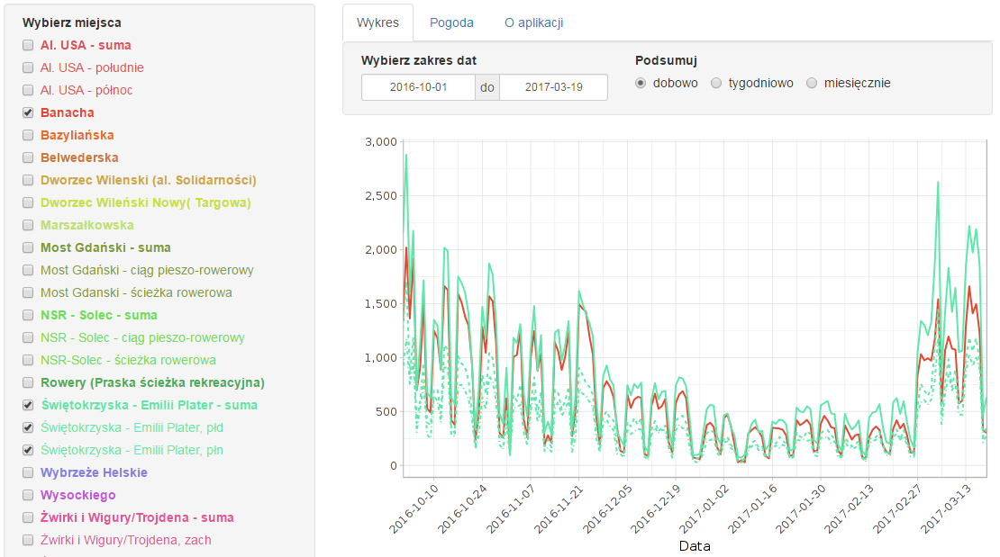

## Navigation
1. [What is this?](#whatisthis)
2. [Data sources](#data)
3. [License](#license)

## What is this? 

This repository containds code and data for the R Shiny app presenting bicycle counters data from the city of Warsaw, Poland. The working app is at http://greenelephant.pl/rowery/

## Data sources 

The data shown by the app is collected by ZDM - Zarząd Dróg Miejskich Miasta Stołecznego Warszawy. ZDM operates automatic bicycle counters (see more here: http://rowery.um.warszawa.pl/pomiary-ruchu-rowerowego ). Raw data was obtained from ZDM via email; currently, there is no other way of obtaining raw data. For this reason, the app is not completely up to date - this would require manually requesting and adding data every day.

The first automatic counters started to operate in August 2014; currently, in January 2017, there are 19 such counters. Right now, the app shows daily, weekly and monthly counts.

## License 

The data used here is "Informacja publiczna" and as such, not protected by copyright; please name the source when reusing the data.

TLDR; You are free to reuse te code any way you want (including commercial) provided that you name the source. ("FreeBSD license")

Copyright (c) 2017, Monika Pawłowska
All rights reserved.

Redistribution and use in source and binary forms, with or without
modification, are permitted provided that the following conditions are met:

1. Redistributions of source code must retain the above copyright notice, this
   list of conditions and the following disclaimer.
2. Redistributions in binary form must reproduce the above copyright notice,
   this list of conditions and the following disclaimer in the documentation
   and/or other materials provided with the distribution.

THIS SOFTWARE IS PROVIDED BY THE COPYRIGHT HOLDERS AND CONTRIBUTORS "AS IS" AND
ANY EXPRESS OR IMPLIED WARRANTIES, INCLUDING, BUT NOT LIMITED TO, THE IMPLIED
WARRANTIES OF MERCHANTABILITY AND FITNESS FOR A PARTICULAR PURPOSE ARE
DISCLAIMED. IN NO EVENT SHALL THE COPYRIGHT OWNER OR CONTRIBUTORS BE LIABLE FOR
ANY DIRECT, INDIRECT, INCIDENTAL, SPECIAL, EXEMPLARY, OR CONSEQUENTIAL DAMAGES
(INCLUDING, BUT NOT LIMITED TO, PROCUREMENT OF SUBSTITUTE GOODS OR SERVICES;
LOSS OF USE, DATA, OR PROFITS; OR BUSINESS INTERRUPTION) HOWEVER CAUSED AND
ON ANY THEORY OF LIABILITY, WHETHER IN CONTRACT, STRICT LIABILITY, OR TORT
(INCLUDING NEGLIGENCE OR OTHERWISE) ARISING IN ANY WAY OUT OF THE USE OF THIS
SOFTWARE, EVEN IF ADVISED OF THE POSSIBILITY OF SUCH DAMAGE.

The views and conclusions contained in the software and documentation are those
of the authors and should not be interpreted as representing official policies,
either expressed or implied, of the FreeBSD Project.
